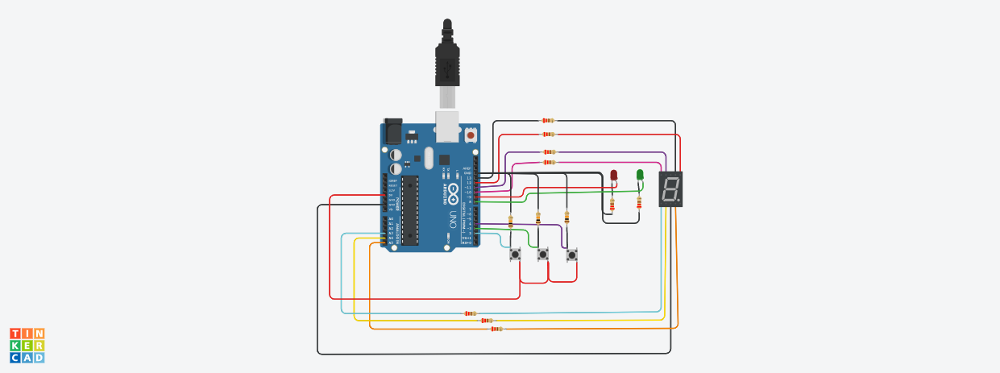
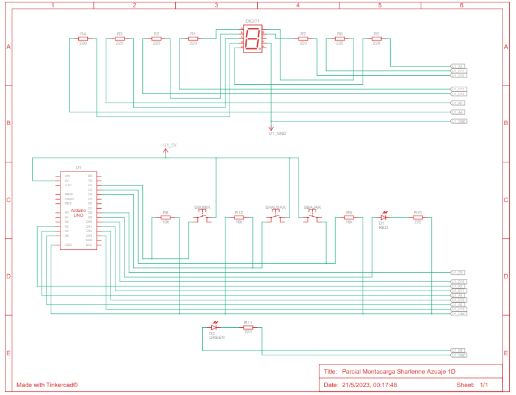

## Alumna
- Sharlenne Azuaje

## Proyecto: Montacarga Funcional.

## Descripción
Modelo de montacarga funcional como maqueta para un hospital. 
Sistema que puede recibir ordenes de subir, bajar o pausar desde diferentes pisos y muestra el estado actual del montacargas en el display 7
segmentos.

## Lista de Componentes

## Diagrama Esquemático del Circuito

## Funciones 

- DISPLAY: 
LED_A, LED_B, LED_C, LED_D, LED_E, LED_F, LED_F son #define que utilizamos para agregar los pines del display.

- BOTONES: 
BOTON_SUBIR, BOTON_BAJAR, BOTON_PAUSAR son #define que utilizamos para agregar los pines de los botones.

- LEDS: 
LED_ROJO, LED_VERDE son #define que utilizamos para agregar los pines de los leds. 

- ESTADOS: 
DETENIDO, SUBIENDO, BAJANDO son #define que utilizamos para establecer los estados del sistema. 

- VARIABLES GLOBALES: 
int piso_actual; -> variable que guarda el piso actual en el que se encuentra el montacarga
int lectura_subir; -> variable que lee el botón subir
int lectura_bajar; -> variable que lee el botón bajar
int lectura_pausar; -> variable que lee el botón pausar
int habilitacion; -> variable tipo bandera que permite identificar en todo momento si el usuario desea pausar el montacarga
int estadoMontacargas; -> variable que guarda el estado del montacarga dependiendo de la ejecución

- Esta función corresponde al loop en donde se llaman a las demás funciones que se desarrollan. 
~~~ C 
void loop(){ 

  MostrarNumeroPorDisplay(piso_actual);
  
  if(estadoMontacargas == DETENIDO){ 
        PrenderLuzRoja();
        lectura_bajar=digitalRead(BOTON_BAJAR);
        lectura_subir=digitalRead(BOTON_SUBIR);
        
        if(lectura_bajar == HIGH || lectura_subir == HIGH){
                if(lectura_subir==HIGH){
                    if(piso_actual < 9){
                      	Serial.println("SUBIENDO...");
                        estadoMontacargas=SUBIENDO;
                    }
                }
                
                if(lectura_bajar==HIGH){ 
                    if(piso_actual > 0){
                        Serial.println("BAJANDO...");
                        estadoMontacargas=BAJANDO;
                    }
                }
        }
  }
  else{ //Está subiendo o bajando
    PrenderLuzVerde();
    
    if(estadoMontacargas == SUBIENDO){
            if(piso_actual < 9){
              	Demora();
              	if(habilitacion==1){
                 	IncrementarPiso();
                  	Serial.println("Usted se encuentra en piso: ");  
  					Serial.println(piso_actual);
              	}
              	else{
                	estadoMontacargas=DETENIDO;
                  	Serial.println("SISTEMA PAUSADO");
              	}
            }
            else{
                estadoMontacargas=DETENIDO;
            }
    }
    else{ //si estadoMontacargas = bajando
            if(piso_actual > 0){
              	Demora();
              	if(habilitacion==1){
                 	DecrementarPiso();
                  	Serial.println("Usted se encuentra en piso: ");  
  					Serial.println(piso_actual);
              	}
              	else{
                	estadoMontacargas=DETENIDO;
                  	Serial.println("SISTEMA PAUSADO");
              	}
            }
            else{
                estadoMontacargas = DETENIDO;
            }
        
    }
  } 
}
~~~

- Esta función incrementa en 1 a la variable global piso_actual.
~~~ C 
void IncrementarPiso(){
    piso_actual++;
}
~~~

- Esta función decrementa en 1 a la variable global piso_actual.
~~~ C 
void DecrementarPiso(){
    piso_actual--;
}
~~~

- Esta función permite identificar el momento en el que el 
usuario decide pausar el sistema.
~~~ C 
void Demora(void){
    habilitacion=1;
    for(int i=0;i<30;i++){
        delay(100);
        lectura_pausar=digitalRead(BOTON_PAUSAR);
        if(lectura_pausar==HIGH){
            habilitacion=0;
            break;
        }
    }
}
~~~

- Esta función apaga el led verde y prende el led rojo.
~~~ C 
void PrenderLuzVerde(){
       digitalWrite(LED_VERDE, HIGH);
       digitalWrite(LED_ROJO, LOW);
}
~~~

- Esta función prende el led verde y apaga el led rojo.
~~~ C 
void PrenderLuzRoja(){
       digitalWrite(LED_VERDE, LOW);
       digitalWrite(LED_ROJO, HIGH);
}
~~~

- Esta función muestra por el display el número correspondiente al número que se le pasa como parámetro.
~~~ C 
void MostrarNumeroPorDisplay(int piso){
   switch(piso)
   {
	case 0:
        digitalWrite(LED_A, HIGH);      
        digitalWrite(LED_B, HIGH); 
        digitalWrite(LED_C, HIGH);
        digitalWrite(LED_D, HIGH);
        digitalWrite(LED_E, HIGH);
        digitalWrite(LED_F, HIGH);
        digitalWrite(LED_G, LOW); 
	    break;
    case 1:
        digitalWrite(LED_A, LOW);      
        digitalWrite(LED_B, HIGH); 
        digitalWrite(LED_C, HIGH);
        digitalWrite(LED_D, LOW);
        digitalWrite(LED_E, LOW);
        digitalWrite(LED_F, LOW);
        digitalWrite(LED_G, LOW); 
	    break;
    case 2:
 	digitalWrite(LED_A, HIGH);      
        digitalWrite(LED_B, HIGH); 
        digitalWrite(LED_C, LOW);
        digitalWrite(LED_D, HIGH);
        digitalWrite(LED_E, HIGH);
        digitalWrite(LED_F, LOW);
        digitalWrite(LED_G, HIGH); 
        break;
	case 3: 
	digitalWrite(LED_A, HIGH);      
        digitalWrite(LED_B, HIGH); 
        digitalWrite(LED_C, HIGH);
        digitalWrite(LED_D, HIGH);
        digitalWrite(LED_E, LOW);
        digitalWrite(LED_F, LOW);
        digitalWrite(LED_G, HIGH); 
	  break;
	case 4:
        digitalWrite(LED_A, LOW);      
        digitalWrite(LED_B, HIGH); 
        digitalWrite(LED_C, HIGH);
        digitalWrite(LED_D, LOW);
        digitalWrite(LED_E, LOW);
        digitalWrite(LED_F, HIGH);
        digitalWrite(LED_G, HIGH); 
        break;
    case 5:
	digitalWrite(LED_A, HIGH);      
        digitalWrite(LED_B, LOW); 
        digitalWrite(LED_C, HIGH);
        digitalWrite(LED_D, HIGH);
        digitalWrite(LED_E, LOW);
        digitalWrite(LED_F, HIGH);
        digitalWrite(LED_G, HIGH); 
	  break;
	case 6:
	digitalWrite(LED_A, HIGH);      
        digitalWrite(LED_B, LOW); 
        digitalWrite(LED_C, HIGH);
        digitalWrite(LED_D, HIGH);
        digitalWrite(LED_E, HIGH);
        digitalWrite(LED_F, HIGH);
        digitalWrite(LED_G, HIGH); 
     	break;
	case 7:
	digitalWrite(LED_A, HIGH);      
        digitalWrite(LED_B, HIGH); 
        digitalWrite(LED_C, HIGH);
        digitalWrite(LED_D, LOW);
        digitalWrite(LED_E, LOW);
        digitalWrite(LED_F, LOW);
        digitalWrite(LED_G, LOW); 
	  break;
	case 8:
	digitalWrite(LED_A, HIGH);      
        digitalWrite(LED_B, HIGH); 
        digitalWrite(LED_C, HIGH);
        digitalWrite(LED_D, HIGH);
        digitalWrite(LED_E, HIGH);
        digitalWrite(LED_F, HIGH);
        digitalWrite(LED_G, HIGH); 
        break;
    case 9:
	digitalWrite(LED_A, HIGH);      
        digitalWrite(LED_B, HIGH); 
        digitalWrite(LED_C, HIGH);
        digitalWrite(LED_D, LOW);
        digitalWrite(LED_E, LOW);
        digitalWrite(LED_F, HIGH);
        digitalWrite(LED_G, HIGH); 
        break;
    }
}

~~~

## :robot: Link al proyecto
- [proyecto](https://www.tinkercad.com/things/2F3XAY52Hho-parcial-montacarga-sharlenne-azuaje-1d-/editel?sharecode=5Ais_VD4vX5r6o4amf1N4mMR5DwPREDrKTnEe2PA34w)
